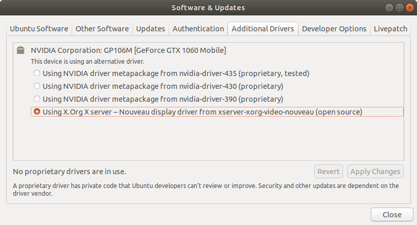
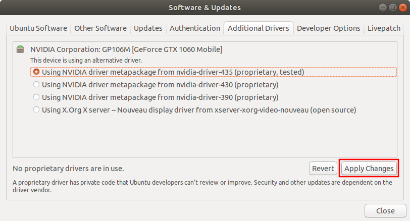
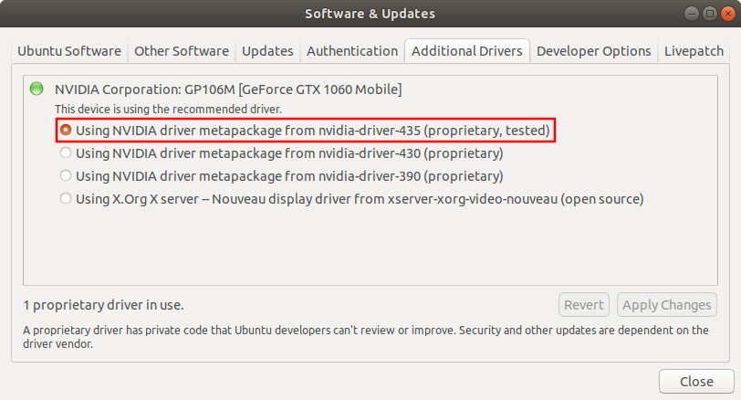
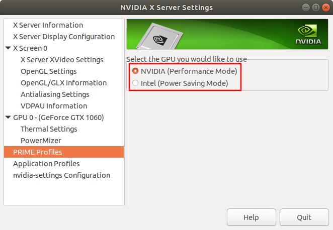

# 1st update repository  
```
$ sudo apt-get update
```

# 2nd check graphic card by GUI
```
system settings > details > Graphics
Software & Updates > Additional Drivers
```



# 2nd check graphic card by CLI
```
$ sudo lshw -C display
  *-display                 
       description: VGA compatible controller
       product: GP106M [GeForce GTX 1060 Mobile]
       vendor: NVIDIA Corporation
       physical id: 0
       bus info: pci@0000:01:00.0
       version: a1
       width: 64 bits
       clock: 33MHz
       capabilities: pm msi pciexpress vga_controller bus_master cap_list rom
       configuration: driver=nouveau latency=0
       resources: irq:140 memory:ee000000-eeffffff memory:d0000000-dfffffff memory:e0000000-e1ffffff ioport:e000(size=128) memory:ef000000-ef07ffff
  *-display
       description: VGA compatible controller
       product: Intel Corporation
       vendor: Intel Corporation
       physical id: 2
       bus info: pci@0000:00:02.0
       version: 04
       width: 64 bits
       clock: 33MHz
       capabilities: pciexpress msi pm vga_controller bus_master cap_list rom
       configuration: driver=i915 latency=0
       resources: irq:139 memory:ed000000-edffffff memory:c0000000-cfffffff ioport:f000(size=64) memory:c0000-dffff

$ sudo ubuntu-drivers devices
== /sys/devices/pci0000:00/0000:00:01.0/0000:01:00.0 ==
modalias : pci:v000010DEd00001C20sv0000144Dsd0000C790bc03sc00i00
vendor   : NVIDIA Corporation
model    : GP106M [GeForce GTX 1060 Mobile]
driver   : nvidia-driver-435 - distro non-free recommended
driver   : nvidia-driver-430 - distro non-free
driver   : nvidia-driver-390 - distro non-free
driver   : xserver-xorg-video-nouveau - distro free builtin
```

# 3rd install nvidia driver by GUI
```
Software & Updates > Additional Drivers > tested > Apply Chages
```



# 4th after install nvidia driver by GUI
```
$ sudo reboot
Software & Updates > Additional Drivers
NVIDIA X Server Settings > PRIME Profiles
```



# 3rd install nvidia driver by CLI
```
$ sudo apt install nvidia-driver-435
```

# 4th after install nvidia driver by CLI
```
$ sudo reboot
$ sudo prime-select query
nvidia

$ nvidia-smi 
Mon Mar 16 16:41:46 2020       
+-----------------------------------------------------------------------------+
| NVIDIA-SMI 435.21       Driver Version: 435.21       CUDA Version: 10.1     |
|-------------------------------+----------------------+----------------------+
| GPU  Name        Persistence-M| Bus-Id        Disp.A | Volatile Uncorr. ECC |
| Fan  Temp  Perf  Pwr:Usage/Cap|         Memory-Usage | GPU-Util  Compute M. |
|===============================+======================+======================|
|   0  GeForce GTX 1060    Off  | 00000000:01:00.0 Off |                  N/A |
| N/A   41C    P0    23W /  N/A |      0MiB /  6078MiB |      2%      Default |
+-------------------------------+----------------------+----------------------+
                                                                               
+-----------------------------------------------------------------------------+
| Processes:                                                       GPU Memory |
|  GPU       PID   Type   Process name                             Usage      |
|=============================================================================|
|  No running processes found                                                 |
+-----------------------------------------------------------------------------+

$ sudo prime-select intel
$ nvidia-smi 
NVIDIA-SMI has failed because it couldn't communicate with the NVIDIA driver. Make sure that the latest NVIDIA driver is installed and running.
```
