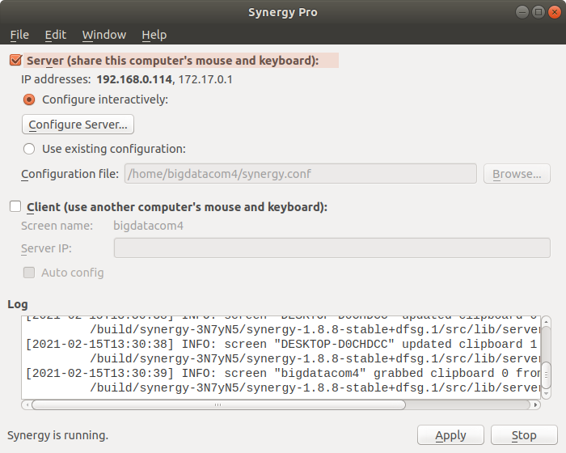

# download  
[free stable version](https://sourceforge.net/projects/synergy-stable-builds/files/v1.8.8-stable/)

# install
```
$ sudo dpkg -i synergy-v1.8.8-stable-Linux-x86_64.deb 
$ sudo apt-get update
$ sudo apt-get install -f
```

# configure Server


# configure Client

